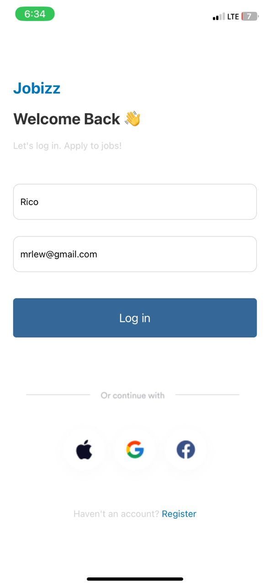
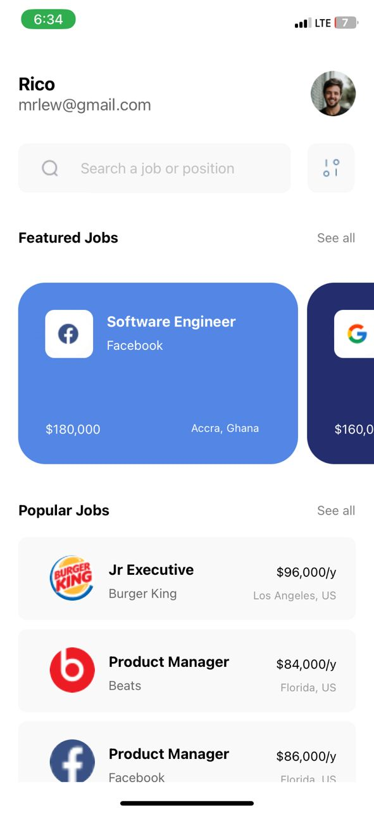
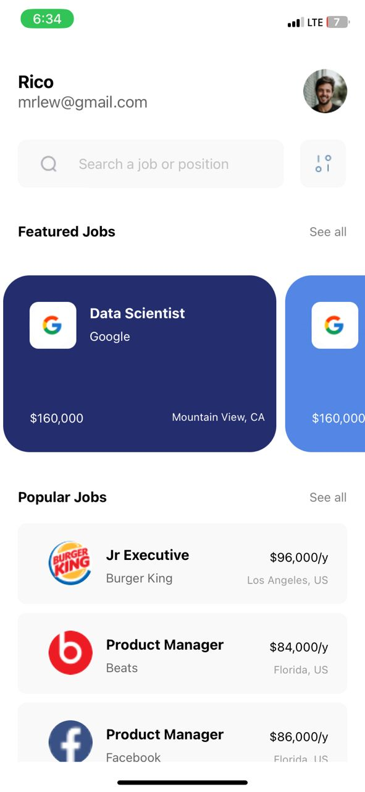

# rn-assignment4-11115960
## Overview
In this assignment, the task was to apply what was taught in screen navigation.

### Components

#### 1. App.js
This is the root component of the application. It sets up the navigation using React Navigation.

- **These dependencies were intsalled:**
  - @react-navigation/native: Core navigation library for React Native apps.
  - `@react-navigation/stack: Stack navigator for managing navigation between screens.
  - `react-native-safe-area-context: Provides safe area insets for various devices.
  - `react-native-screens: Optimized native navigation components.

- **Usage:**
  - Initializes a  'StackNavigator' using createStackNavigator.
  - There are two screens screens meant to be navigated:
    - The 'Login' screen: This is the primary screen where users log in.
    - Homepage: This is the screen displayed after successful login.

### 2. Login.js

This component handles user authentication and login functionality.

- **Features and Functionality:**
  - Displays a form with input fields for name and email.
  - Validates user input:
    - Ensures both fields are filled.
    - Validates email format using regex.
  - Navigates to the Homepage screen upon successful login.

- **UI Elements Used:**
  - TextInput For entering name and email.
  - TouchableOpacity: Button for triggering the login action.
  - Image: Displays icons and decorative images.

### 3. HomePage.js

The homepage is displayed after a successful log in.
- **Features:**
  - Displays user's name and email fetched from navigation params.
  - Provides search functionality and navigation to detailed job views.
  - Lists featured and popular job listings:
    - Uses FlatList for scrolling through job cards.
    - Includes job title, company name, salary, location, and company logo.

- **UI Elements Used:**
  - ScrollView: It enables vertically scrolling through content.
  - SafeAreaView: Ensures that the content renders within safe area bounds.
  - FlatList: Renders lists with optimized performance.
  - TouchableOpacity: Allows tapping on interactive elements like the buttons.
  - ImageBackground: Background image for job cards.
  - Various styles for layout, text, and image styling.

### SCREENSHOTS: 

